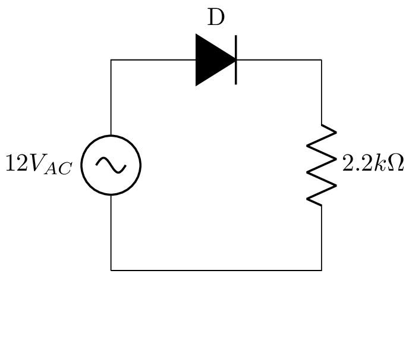
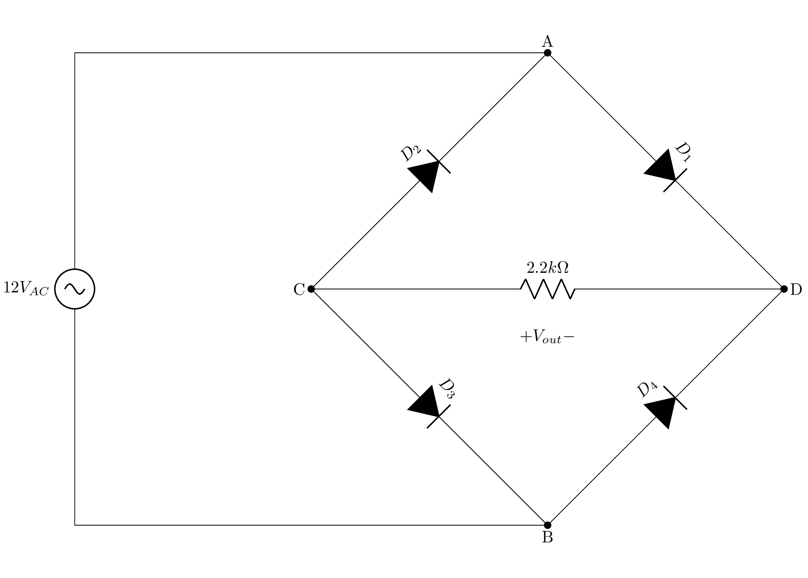

<meta charset="utf-8">

<figure markdown=1>

<figcaption>CEFET-MG — Centro Federal de Educação Tecnológica de Minas Gerais</figcaption>
</figure>

DEPARTAMENTO DE COMPUTAÇÃO DE DIVINÓPOLIS — DECOM-DV

Laboratório de Eletrônica

Turma: 2024/1

Prof. M. Sc. Diego Ascânio Santos

<label for="alunos">Alunos: </label>
<input type="text" id="alunos" name="alunos" size="80" >

<label for="data">Data: </label>
<input type="date" id="data" name="data">

# Aula Prática 01 — Circuitos Retificadores

## Objetivos

-   Verificar o funcionamento do Diodo em circuitos retificadores;
-   Compreender o funcionamento dos circuitos retificadores de meia onda e onda completa;
-   Analisar a influência do filtro capacitivo na tensão de saída de um circuito retificador;
-   Efetuar medidas de tensão elétrica com um multímetro e um osciloscópio.

## Conceitos Teóricos

### Diodo

Na área da eletrônica, uma variedade de componentes são empregados na elaboração de circuitos, incluindo Diodos, Transistores e Circuitos Integrados, que são fundamentalmente construídos a partir de semicondutores. Os semicondutores são materiais que não se classificam nem como condutores nem como isolantes, apresentando uma resistividade elétrica que se situa entre ambos, como é o caso do Germânio e do Silício. Estes possuem 4 elétrons na sua camada de valência. Para a fabricação desses componentes, utilizam-se cristais semicondutores dopados. A dopagem de um semicondutor pode resultar em um excesso de elétrons livres ou em um excesso de lacunas (ausência de elétrons). Por isso, existem dois tipos de semicondutores: o tipo N e o tipo P.

O diodo é formado pela combinação de um cristal do tipo P e um cristal do tipo N, resultando em uma junção PN, que constitui um dispositivo de estado sólido básico: o diodo semicondutor de junção. A estrutura é ilustrada na Figura 1 e um encapsulamento típico é mostrado na Figura 2.

<figure markdown=1>

<figcaption>Figura 1: Junção do cristal P ao cristal N formando um diodo.</figcaption>
</figure>

<figure markdown=1>

<figcaption>Figura 2: Encapsulamento típico de um diodo.</figcaption>
</figure>

O encapsulamento mostrado na Figura 2 apresenta uma tarja branca que indica o terminal catodo (K) e uma tarja preta que indica o terminal anodo (A). A corrente elétrica flui do anodo para o catodo, e o diodo só conduz corrente elétrica no sentido do anodo para o catodo. A tensão de polarização direta do diodo é da ordem de 0,7 V para o silício e 0,3 V para o germânio. A tensão de polarização reversa é da ordem de 50 V para o silício e 10 V para o germânio. A corrente de fuga reversa é da ordem de 1 µA para o silício e 10 µA para o germânio.

### Circuito Retificador

O circuito retificador é um circuito eletrônico que converte a corrente alternada (CA) em corrente contínua (CC). A corrente alternada é uma corrente elétrica que muda de direção periodicamente, enquanto a corrente contínua é uma corrente elétrica que flui em uma única direção. A conversão de corrente alternada em corrente contínua é chamada de retificação. A retificação pode ser feita de duas maneiras: meia onda e onda completa.

### Filtro Capacitivo

A tensão de saída de um circuito retificador é pulsante, ou seja, apresenta variações de tensão ao longo do tempo. Para suavizar essas variações — procedimento necessário em aplicações onde a tensão contínua deve ser constante — utiliza-se um filtro capacitivo. O filtro capacitivo é um circuito eletrônico que utiliza capacitores para suavizar a tensão de saída de um circuito retificador. O capacitor armazena energia elétrica e libera essa energia quando a tensão de saída do circuito retificador cai. O filtro capacitivo é composto por um ou mais capacitores, que são conectados em paralelo com a carga.

Com o filtro capacitivo a tensão de saída é uma forma de onda CC quase constante, apresentando somente uma pequena variação nos valores máximos _(ripple)_ causada pela carga e descarga do capacitor.

## Atividade Experimental

### Materiais e Equipamentos

-   4 Diodos;
-   1 Resistor de \\( 2.2 k\Omega \\);
-   1 Capacitor de \\( 47 \mu F \\);
-   Multímetro;
-   Sinais senoidas de tensão alternada de 12V e 60Hz;
-   Osciloscópio;
-   Breadboard;

### Retificador de Meia Onda

1. Como mostrado pela Figura 3, monte o circuito retificador de meia onda na breadboard.
    
    <figure markdown=1>
    
    
    
    <figcaption>Figura 3 — Retficador de Meia Onda</figcaption>
    </figure>

2. Em posse do multímetro, meça e preencha na tabela abaixo as respectivas grandezas:
    
    | Medida                                                                                                        | Valor                  | Unidade               |
    | ------------------------------------------------------------------------------------------------------------- | ---------------------- | --------------------- |
    | [Tensão Eficaz — \\(V\_{\text{AC}}\\)](https://www.mundodaeletrica.com.br/o-que-e-corrente-ou-tensao-eficaz/) | <input type="number"/> | \\(V\_{\text{RMS}}\\) |
    | Tensão Eficaz — \\(R\_{2.2 k\Omega}\\)                                                                        | <input type="number"/> | \\(V\_{\text{RMS}}\\) |
    | Tensão Contínua — \\(R\_{2.2 k\Omega}\\)                                                                      | <input type="number"/> | \\(V\_{\text{DC}}\\)  |

3. Com os dados da tabela acima e com as fórmulas necessárias, calcule:
    
    | Grandeza                                 | Valor Calculado        | Unidade               |
    | ---------------------------------------- | ---------------------- | --------------------- |
    | \\(I_{R_{2.2 k\Omega}}\\)                | <input type="number"/> | \\(A\_{\text{RMS}}\\) |
    | \\(P_{R_{2.2 k\Omega}}\\)                | <input type="number"/> | \\(mW\\)              |
    | Tensão Eficaz — \\(R\_{2.2 k\Omega}\\)   | <input type="number"/> | \\(V\_{\text{RMS}}\\) |
    | Tensão Contínua — \\(R\_{2.2 k\Omega}\\) | <input type="number"/> | \\(V\_{\text{DC}}\\)  |

4. Conecte um canal do osciloscópio em um ponto de entrada da fonte do gerador de sinais e o outro canal em um ponto de saída do circuito retificador. Ajuste o osciloscópio para visualizar a forma de onda de entrada e saída do circuito retificador.

5. Com base na forma de onda obtida no osciloscópio, bem como, pelos dados obtidos no equipamento preencha a tabela abaixo:
    
    | Medida                                                     | Valor                  | Unidade                |
    | ---------------------------------------------------------- | ---------------------- | ---------------------- |
    | Tensão Eficaz — \\(V\_{\text{AC}}\\)                       | <input type="number"/> | \\(V\_{\text{RMS}}\\)  |
    | Tensão Eficaz — \\(R\_{2.2 k\Omega}\\)                     | <input type="number"/> | \\(V\_{\text{RMS}}\\)  |
    | Tensão Contínua — \\(R\_{2.2 k\Omega}\\)                   | <input type="number"/> | \\(V\_{\text{DC}}\\)   |
    | Tensão de Pico — \\(V\_{\text{AC}\_{p}}\\)                 | <input type="number"/> | \\(V\_{\text{pico}}\\) |
    | Tensão de Pico Reversa sobre o Diodo — \\(V\_{\text{D}}\\) | <input type="number"/> | \\(V\_{\text{pico}}\\) |
    | Período \\((T)\\)                                          | <input type="number"/> | \\(s\\)                |
    | Frequência \\((f)\\)                                       | <input type="number"/> | \\(Hz\\)               |

6. Desenhe (ou carregue fotos) as formas de onda obtidas no osciloscópio para as grandezas abaixo:
    
    <label for="vac-half-wave" markdown=1>1. Tensão da entrada \\(V\_{\text{AC}}\\): </label>
    <input type="file" name="vac-half-wave" onchange="carregarImagem(this, 'vac-half-wave');">
    

    

    <label for="vout-half-wave" markdown=1>2. Tensão da saída \\(V_{R_{2.2 k\Omega}}\\): </label>
    <input type="file" name="vout-half-wave" onchange="carregarImagem(this, 'vout-half-wave');">
    

    

    <label for="vdp-half-wave" markdown=1>3. Tensão de Pico Reversa sobre o Diodo — \\(V\_{\text{D}}\\): </label>
    <input type="file" name="vdp-half-wave" onchange="carregarImagem(this, 'vdp-half-wave');">
    

    

7. Conecte o capacitor de \\(47 \mu F\\) em paralelo ao resistor de \\(2.2 k\Omega\\). Preencha a tabela abaixo com os respectivos valores obtidos:
    
    | Medida                                      | Valor medido no Multímetro | Valor medido no Osciloscópio | Unidade                |
    | ------------------------------------------- | -------------------------- | ---------------------------- | ---------------------- |
    | Tensão Eficaz — \\(V\_{\text{AC}}\\)        | <input type="number"/>     | <input type="number"/>       | \\(V\_{\text{RMS}}\\)  |
    | Tensão de Pico — \\(V\_{\text{AC}\_{P}}\\)  | <input type="number"/>     | <input type="number"/>       | \\(V\_{\text{pico}}\\) |
    | Tensão Eficaz — \\(V_{R_{2.2 k\Omega}}\\)   | <input type="number"/>     | <input type="number"/>       | \\(V\_{\text{RMS}}\\)  |
    | Tensão Contínua — \\(V_{R_{2.2 k\Omega}}\\) | <input type="number"/>     | <input type="number"/>       | \\(V\_{\text{DC}}\\)   |
    | Tensão de Pico — \\(V_{R_{2.2 k\Omega}}\\)  | <input type="number"/>     | <input type="number"/>       | \\(V\_{\text{pico}}\\) |
    | Potência Ativa — \\(P_{R_{2.2 k\Omega}}\\)  | <input type="number"/>     | <input type="number"/>       | \\(mW\\)               |

8. Desenhe (ou carregue fotos) as formas de onda obtidas no osciloscópio para as grandezas abaixo:
    
    <label for="vac-half-wave-cap" markdown=1>1. Tensão da entrada \\(V\_{\text{AC}}\\) sobreposta a tensão de saída \\(V\_{R\_{2.2 k \Omega}}\\): </label>
    <input type="file" name="vac-half-wave-cap" onchange="carregarImagem(this, 'vac-half-wave-cap');">
    

    

### Retificador de Onda Completa

O Retificador de onda completa estudado no laboratório será o de onda completa em ponte, que não depende da utilização de transformadores. A Figura 4 mostra o circuito retificador de onda completa em ponte:

<figure markdown=1>

<figcaption>Figura 4 — Retficador de Onda Completa</figcaption>
</figure>

Como podemos observar na Figura 4 a saída da tensão retificada é dada pela diferença de potencial entre os pontos \\(C\\) e \\(D\\).

1. Monte o circuito retificador de onda completa em ponte na breadboard.
2. Conecte um canal do osciloscópio em um ponto de entrada da fonte do gerador de sinais e o outro canal em um ponto de saída do circuito retificador. Ajuste o osciloscópio para visualizar a forma de onda de entrada e saída do circuito retificador.
3. Meça e preencha na tabela abaixo as respectivas grandezas:
    
    | Medida                                   | Valor do Multímetro    | Valor do Osciloscópio  | Unidade                |
    | ---------------------------------------- | ---------------------- | ---------------------- | ---------------------- |
    | \\(V_{\text{AC}}\\)                      | <input type="number"/> | <input type="number"/> | \\(V\_{\text{RMS}}\\)  |
    | \\(V_{\text{AC}\_{P}}\\)                 | <input type="number"/> | <input type="number"/> | \\(V\_{\text{pico}}\\) |
    | \\(V_{R\_{2.2k \Omega}}\\)               | <input type="number"/> | <input type="number"/> | \\(V\_{\text{RMS}}\\)  |
    | \\(V_{R\_{{2.2k \Omega}\_{DC}}}\\)       | <input type="number"/> | <input type="number"/> | \\(V\_{\text{CC}}\\)   |
    | \\(V_{R\_{{2.2k \Omega}\_{P}}}\\)        | <input type="number"/> | <input type="number"/> | \\(V\_{\text{pico}}\\) |

4. Com os dados da tabela acima calcule:
    
    | Grandeza                    | Valor                 |      Unidade         |
    | --------------------------- | --------------------- | -------------------- |
    | \\(I\_{R\_{2.2 k\Omega}}\\) | <input type="number"> | \\(A_{\text{RMS}}\\) |
    | \\(P\_{R\_{2.2 k\Omega}}\\) | <input type="number"> | mW                   |
    | \\(V\_{R\_{2.2 k\Omega}}\\) | <input type="number"> | \\(V_{\text{RMS}}\\) |
    | \\(V\_{R\_{2.2 k\Omega}}\\) | <input type="number"> | \\(V_{\text{CC}}\\)  |

5. Desenhe (ou carregue fotos) as formas de onda obtidas no osciloscópio para as grandezas abaixo:
    
    <label for="vac-full-wave" markdown=1>1. Tensão da entrada \\(V\_{\text{AC}}\\): </label>
    <input type="file" name="vac-full-wave" onchange="carregarImagem(this, 'vac-full-wave');">
    

    

    <label for="vout-full-wave" markdown=1>2. Tensão da saída \\(V_{R_{2.2 k\Omega}}\\): </label>
    <input type="file" name="vout-full-wave" onchange="carregarImagem(this, 'vout-full-wave');">
    

6. Adicione o capacitor de \\(47 \mu F\\) em paralelo ao resistor. Com o capacitor em paralelo, meça e preencha:

    | Medida                                   | Valor do Multímetro    | Valor do Osciloscópio  | Unidade                |
    | ---------------------------------------- | ---------------------- | ---------------------- | ---------------------- |
    | \\(V_{\text{AC}}\\)                      | <input type="number"/> | <input type="number"/> | \\(V\_{\text{RMS}}\\)  |
    | \\(V_{\text{AC}\_{P}}\\)                 | <input type="number"/> | <input type="number"/> | \\(V\_{\text{pico}}\\) |
    | \\(V_{R\_{2.2k \Omega}}\\)               | <input type="number"/> | <input type="number"/> | \\(V\_{\text{RMS}}\\)  |
    | \\(V_{R\_{{2.2k \Omega}\_{DC}}}\\)       | <input type="number"/> | <input type="number"/> | \\(V\_{\text{CC}}\\)   |
    | \\(V_{R\_{{2.2k \Omega}\_{P}}}\\)        | <input type="number"/> | <input type="number"/> | \\(V\_{\text{pico}}\\) |

7. Desenhe (ou carregue fotos) as formas de onda obtidas no osciloscópio para as grandezas abaixo:
    
    <label for="vac-full-wave-cap" markdown=1>1. Tensão da entrada \\(V\_{\text{AC}}\\) sobreposta a tensão de saída \\(V\_{R\_{2.2 k \Omega}}\\): </label>
    <input type="file" name="vac-full-wave-cap" onchange="carregarImagem(this, 'vac-full-wave-cap');">
    

    

## Questões Pós Experimentos

1. Compare os valores médios das tensões nos dois tipos de retificadores estudados. Comente as diferenças.
    <textarea rows="10" cols="80"></textarea>

2. Se usarmos um capacitor de \\(1000 \mu F\\) como filtro, qual o comportamento de ambos os retificadores referente à tensão e à corrente?
    <textarea rows="10" cols="80"></textarea>
    - Use o simulador [Falstad](https://www.falstad.com/circuit/circuitjs.html) para simular o comportamento dos retificadores com o filtro capacitivo de \\(1000 \mu F\\).

## Referências

1. MALVINO, A. P.; BATES, D. J. Eletrônica. Vol. 1. 7. ed. São Paulo: McGraw-Hill, 2007.
2. BOYLESTAD, R. L.; NASHELSKY, L. Dispositivos Eletrônicos e Teoria de Circuitos. 8. ed. São Paulo: Pearson Prentice Hall, 2004.
3. DEQUIGIOVANI, T. Roteiro Experimental — Circuitos Retificadores. Disponível em: [https://professor.luzerna.ifc.edu.br/tiago-dequigiovani/wp-content/uploads/sites/22/2016/02/TD_ELB_Roteiros.Experimentais_1.pdf](https://professor.luzerna.ifc.edu.br/tiago-dequigiovani/wp-content/uploads/sites/22/2016/02/TD_ELB_Roteiros.Experimentais_1.pdf). Acesso em: 18 de Março de 2024.

## Formulário

|                              | Tensão Eficaz                                            | Tensão Média                                    |
| ---------------------------- | -------------------------------------------------------- | ----------------------------------------------- |
| Fórmula Geral                | \\(V_{ef} = \frac{1}{T} \sqrt{\int_{0}^{T} v^2(t) dt}\\) | \\(V_{CC} = \frac{1}{T} \int_{0}^{T} v(t) dt\\) |
| Retificador de Meia Onda     | \\(V_{o} = \frac{V_{ef}}{\sqrt{2}}\\)                    | \\(V_{CC} = \frac{\sqrt{2} V_{ef}}{\pi}\\)      |
| Retificador de Onda Completa | \\(V_{o} = V_{ef}\\)                                     | \\(V_{CC} = \frac{2 \sqrt{2} V_{ef}}{\pi}\\)    |
